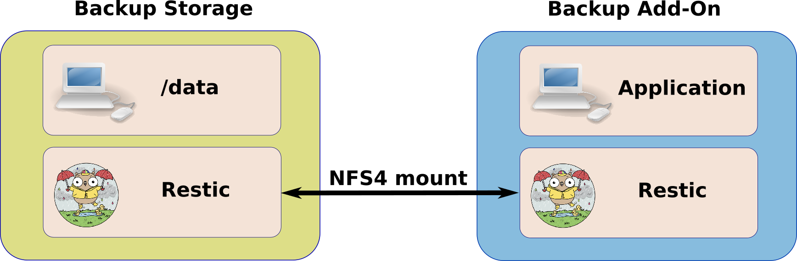
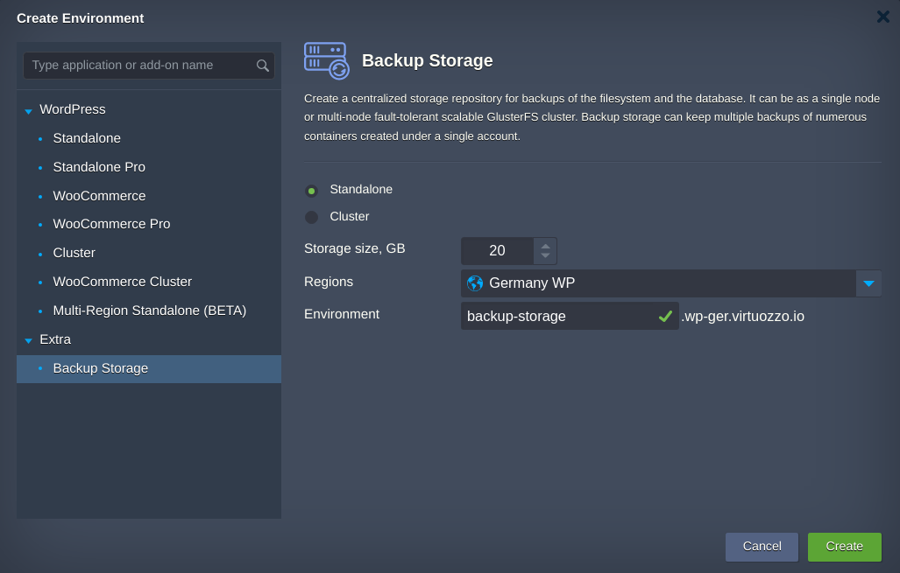
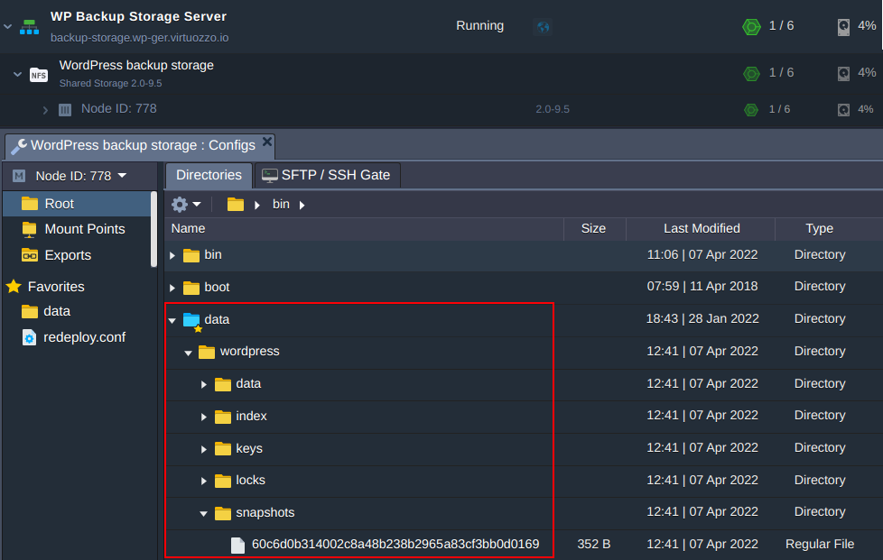

  

# Backup Storage

Backup Storage is a solution that creates a [shared storage](https://docs.jelastic.com/shared-storage-container/) node and allows to create on it the backup repositories for Virtuozzo Application Platform environments. 

As a backup software the [Restic](https://restic.net/) is used.

Restic is a program to make a security copy for free and fast. It is a secure, cross-platform, open source program written in the Go programming language.

Restic encrypts data using AES-256 and authenticates it using Poly1305-AES. Backing up is incremental process and is based on snapshotting of the specific directory or even the whole server that makes the process is really fast.

## How to use Backup Storage

Backup Storage node works in tandem with [Backup Add-On](https://github.com/jelastic-jps/backup-addon). They both have preinstalled Restic software, which do different fucntions.

On the backup storage node, the Restic is used to serve requests from Application's Restic instance providing information regarding storage and available backup snapshots for the environment the Backup Add-On is installed on. Thus the Application's Restic decides what backup/restore actions should be done.  
 
## Installation Process
1. Import the [link of the manifest](https://github.com/jelastic-jps/backup-storage/blob/main/storage.jps) within Virtuozzo Application Platform for WordPress dashboard

 

 or invoke installation from **New Environment>Extra**.

 

2. In the opened window, choose the storage topology either **Standalone** node or GlusterFS **Cluster**, storage size, destination **Region** and press **Install**. 

> **Note:** Keep in mind that in case several Regions are available you can increase data safety choosing different region unlike one the application is installed on. Thus if Application host node fails the backup storage host node keeps data and vice versa.

3. When the installation is finished, the Backup Storage is ready to work.

All the backup data is stored in the shared directory **/data**.

 

